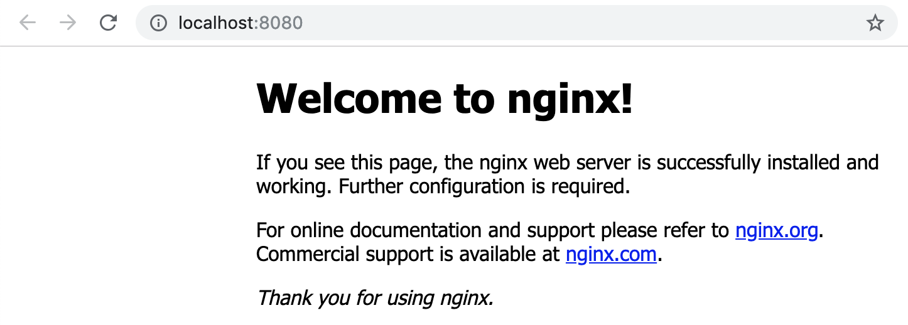

# Lab 04 - Pods

In this lab we will run our first, very basic, application on Kubernetes.  We
will basically run a single pod as our application.

## Task 1: Creating a namespace

Create a namespace for this lab:

```
kubectl create ns lab-04

---

namespace "lab-04" created
```

Verify that your namespace was created:

```
kubectl get namespaces

---

NAME             STATUS    AGE
default          Active    1h
kube-public      Active    1h
kube-system      Active    1h
lab-04           Active    7s
```

## Task 2: Starting your first pod

To run your first pod (the official nginx container image), run the following
command:

```
kubectl run --restart=Never --image=nginx  nginx -n lab-04

---

pod "nginx" created
```

The above command will create a single pod that is based on the official nginx
container image.  Run the following command to verify that the pod has been
created and is in the running state (if the pod is not yet in the running state
wait a couple of seconds and try to run the command again):

```
kubectl get pods -n lab-04

---

NAME      READY     STATUS    RESTARTS   AGE
nginx     1/1       Running   0          22s
```

As we have not yet configured any services and/or ingresses we will use a litte
"hack" to access our pod we just created.

Run the following command to forward the port of the pod (in our case port 80)
running in our Kubernetes cluster to a port on your laptop (in this case port
8080).

```
kubectl port-forward pod/nginx 8080:80 -n lab-04
```

> NOTE: your prompt will be locked by the port-forward process

Now go to your browser and surf to http://localhost:8080, you should be greeted
with the default nginx welcome page:



If that works you can close the port-foward connection by pressing `CTRL+c`.

## Task 3: Connecting to your pod

To connect to your pod, you can use the following command (notice how it
resembles the `podman container exec` command in options and functionality):

```
kubectl exec -ti nginx -n lab-04 -- bash

---

root@nginx:/#
```

Notice how the prompt changes.  `exec`-ing into a pod is very powerful for
troubleshooting, but keep in mind that by default pods/containers are immutable
so remember to not make any changes inside the pods/container.

To exit run the `exit` command.

```
exit
```

## Task 4: Pod logs

Again similar to when working with Podman containers, Kubernetes has a built-in
feature that exposes all stdout/stderr output into logs.  To access those logs
issue the following command:

```
kubectl logs nginx -n lab-04

---

127.0.0.1 - - [11/Mar/2019:11:40:47 +0000] "GET / HTTP/1.1" 200 612 "-" "curl/7.52.1" "-"
127.0.0.1 - - [11/Mar/2019:11:40:48 +0000] "GET / HTTP/1.1" 200 612 "-" "curl/7.52.1" "-"
127.0.0.1 - - [11/Mar/2019:11:40:49 +0000] "GET / HTTP/1.1" 200 612 "-" "curl/7.52.1" "-"
127.0.0.1 - - [11/Mar/2019:11:40:50 +0000] "GET / HTTP/1.1" 200 612 "-" "curl/7.52.1" "-"
```

> NOTE: if your logs are empty, repeat Task 2 where you `kubectl port-forward` 
> the container port and hit reload the page a couple more times in your 
> browser

A very handy option of `kubectl logs` is that you can follow them using the `-f`
option, this is extremely useful when troubleshooting:

```
kubectl logs nginx -n lab-04 -f
```

Hit `CTRL+c` to exit the logs.

## Task 5: Getting pod details

Like with most objects in Kubernetes you can use the `kubectl describe` command 
to get more information about a specific pod, for example:

```
kubectl describe pods nginx -n lab-04

---

Name:         nginx
Namespace:    lab-04
Priority:     0
Node:         minikube/10.0.2.15
Start Time:   Thu, 29 Aug 2019 11:23:56 +0200
Labels:       run=nginx
Annotations:  <none>
Status:       Running
IP:           172.17.0.2
Containers:
  nginx:
    Container ID:   docker://185da953fb9332cdbaa3516f2240255a6fddc8538f58a277d2f826a469bd6f26
    Image:          nginx
    Image ID:       docker-pullable://nginx@sha256:aeded0f2a861747f43a01cf1018cf9efe2bdd02afd57d2b11fcc7fcadc16ccd1
    Port:           <none>
    Host Port:      <none>
    State:          Running
      Started:      Thu, 26 Sep 2019 11:45:15 +0200
    Last State:     Terminated
      Reason:       Error
      Exit Code:    255
      Started:      Fri, 30 Aug 2019 14:46:25 +0200
      Finished:     Thu, 26 Sep 2019 11:42:56 +0200
    Ready:          True
    Restart Count:  2
    Environment:    <none>
    Mounts:
      /var/run/secrets/kubernetes.io/serviceaccount from default-token-4hztg (ro)
Conditions:
  Type              Status
  Initialized       True
  Ready             True
  ContainersReady   True
  PodScheduled      True
Volumes:
  default-token-4hztg:
    Type:        Secret (a volume populated by a Secret)
    SecretName:  default-token-4hztg
    Optional:    false
QoS Class:       BestEffort
Node-Selectors:  <none>
Tolerations:     node.kubernetes.io/not-ready:NoExecute for 300s
                 node.kubernetes.io/unreachable:NoExecute for 300s
Events:
  Type    Reason          Age   From               Message
  ----    ------          ----  ----               -------
  Normal  SandboxChanged  30m   kubelet, minikube  Pod sandbox changed, it will be killed and re-created.
  Normal  Pulling         30m   kubelet, minikube  Pulling image "nginx"
  Normal  Pulled          30m   kubelet, minikube  Successfully pulled image "nginx"
  Normal  Created         30m   kubelet, minikube  Created container nginx
  Normal  Started         30m   kubelet, minikube  Started container nginx
```

## Task 6: Cleaning up

Clean up the namespace for this lab:

```
kubectl delete ns lab-04

---

namespace "lab-04" deleted
```
